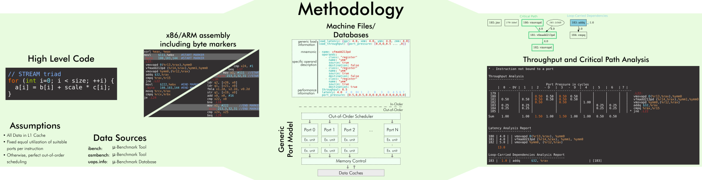

   
OSACA
=====

Open Source Architecture Code Analyzer
--------------------------------------

For an innermost loop kernel in assembly, this tool allows automatic instruction fetching of assembly code and automatic runtime prediction including throughput analysis and detection for critical path and loop-carried dependencies.

.. image:: https://github.com/RRZE-HPC/OSACA/workflows/test-n-publish/badge.svg?branch=master&event=push
    :target: https://github.com/RRZE-HPC/OSACA/actions
    :alt: Build Status

.. image:: https://codecov.io/github/RRZE-HPC/OSACA/coverage.svg?branch=master
    :target: https://codecov.io/github/RRZE-HPC/OSACA?branch=master
    :alt: Code Coverage

.. image:: https://readthedocs.org/projects/osaca/badge/?version=latest
    :target: https://osaca.readthedocs.io/en/latest/?badge=latest
    :alt: Documentation Status

.. image:: https://img.shields.io/badge/read-the_docs-blue
    :target: https://osaca.readthedocs.io/
    :alt: Docs

.. image:: https://img.shields.io/badge/code%20style-black-000000.svg
    :target: https://github.com/ambv/black
    :alt: Code Style

Getting started
===============
OSACA is as a python module with a command line interface.

OSACA is also integrated into the `Compiler Explorer at godbolt.org <https://godbolt.org>`_, which allows using OSACA from a browser without any installation. To analyze an assembly snippet, go to https://godbolt.org change language to "Analysis", insert an AArch64 or AT&T(!) x86 assembly code and make sure OSACA is selected in the corresponding analysis panel, e.g., https://godbolt.org/z/shK4f8. When analyzing a high-level language code, use the "Add tool..." menu in the compiler output panel to add OSACA analysis, e.g. https://godbolt.org/z/hbMoPn. To change the micro architecture model, add ``--arch`` and µarch shortname (e.g., ``SKX`` for Skylake, ``ZEN2``, ``N1`` for ARM Neoverse) to the "Compiler options..." (when using "Analysis" mode) or "Arguments" (when analyzing compiler output of a high-level code).

Installation
------------
On most systems with python pip and setuputils installed, just run:

.. code:: bash

    pip install --user osaca

for the latest release.

To build OSACA from source, clone this repository using ``git clone https://github.com/RRZE-HPC/OSACA`` and run in the root directory:

.. code:: bash

   python ./setup.py install

After installation, OSACA can be started with the command ``osaca`` in the CLI.

Dependencies:
-------------
Additional requirements are:

-  `Python3 <https://www.python.org/>`__
-  `Graphviz <https://www.graphviz.org/>`__ for dependency graph creation (minimal dependency is `libgraphviz-dev` on Ubuntu)

Optional requirements are:

-  `Kerncraft <https://github.com/RRZE-HPC/kerncraft>`__ >=v0.8.4 for marker insertion
-   `ibench <https://github.com/RRZE-HPC/ibench>`__ or `asmbench <https://github.com/RRZE-HPC/asmbench/>`__ for throughput/latency measurements
- `BeautifulSoup4 <https://www.crummy.com/software/BeautifulSoup/bs4/doc/>`__ for scraping instruction form information for the x86 ISA (experimental)

Design
======
A schematic design of OSACA's workflow is shown below:

Usage
=====

The usage of OSACA can be listed as:

.. code:: bash

    osaca [-h] [-V] [--arch ARCH] [--fixed] [--lines LINES]
    	  [--ignore-unknown] [--lcd-timeout SECONDS]
    	  [--db-check] [--import MICROBENCH] [--insert-marker]
	  [--export-graph GRAPHNAME] [--out OUT] [--verbose]
	  FILEPATH

-h, --help
  prints out the help message.
-V, --version
  shows the program’s version number.
--arch ARCH
  needs to be replaced with the target architecture abbreviation.
  Possible options are ``SNB``, ``IVB``, ``HSW``, ``BDW``, ``SKX``, ``CSX`` and ``ICL`` for the latest Intel micro architectures starting from Intel Sandy Bridge and ``ZEN1``, ``ZEN2`` for AMD Zen architectures.
  Furthermore, ``TX2`` for Marvell`s ARM-based ThunderX2 , ``N1`` for ARM's Neoverse  and ``A64FX`` for Fujitsu's HPC ARM architecture are available.
  If no micro-architecture is given, OSACA assumes a default architecture for x86/AArch64.
--fixed
  Run the throughput analysis with fixed port utilization for all suitable ports per instruction.
  Otherwise, OSACA will print out the optimal port utilization for the kernel.
--lines
  Define lines that should be included in the analysis. This option overwrites any range defined by markers in the assembly. Add either single lines or ranges defined
  by "-" or ":", each entry separated by commas, e.g.: ``--lines 1,2,8-18,20:24``
--db-check
  Run a sanity check on the by "--arch" specified database.
  The output depends on the verbosity level.
  Keep in mind you have to provide an existing (dummy) filename in anyway.
--import MICROBENCH
  Import a given microbenchmark output file into the corresponding architecture instruction database.
  Define the type of microbenchmark either as "ibench" or "asmbench".
--insert-marker
  OSACA calls the Kerncraft module for the interactively insertion of `IACA <https://software.intel.com/en-us/articles/intel-architecture-code-analyzer>`__ byte markers or OSACA AArch64 byte markers in suggested assembly blocks.
--export-graph EXPORT_PATH
  Output path for .dot file export. If "." is given, the file will be stored as "./osaca_dg.dot".
  After the file was created, you can convert it to a PDF file using `dot <https://graphviz.gitlab.io/_pages/pdf/dotguide.pdf>`__.
--ignore-unknown
  Force OSACA to apply a throughput and latency of 0.0 cy for all unknown instruction forms.
  If not specified, a warning will be printed instead if one ore more isntruction form is unknown to OSACA.
--lcd-timeout SECONDS
  Set timeout in seconds for LCD analysis. After timeout, OSACA will continue its analysis with the dependency paths found up to this point.
  Defaults to `10`.
-v, --verbose
  Increases verbosity level
-o OUT, --out OUT
  Write analysis to this file (default to stdout)

The **FILEPATH** describes the filepath to the file to work with and is always necessary, use "-" to read from stdin.

______________________

Hereinafter OSACA's scope of function will be described.

Throughput & Latency analysis
-----------------------------
As main functionality of OSACA, the tool starts the analysis on a marked assembly file by running the following command with one or more of the optional parameters:

.. code-block:: bash

    osaca --arch ARCH [--fixed] [--ignore-unknown]
                      [--export-graph EXPORT_PATH]
          file

The ``file`` parameter specifies the target assembly file and is always mandatory.

The parameter ``ARCH`` is positional for the analysis and must be replaced by the target architecture abbreviation.

OSACA assumes an optimal scheduling for all instructions and assumes the processor to be able to schedule instructions in a way that it achieves a minimal reciprocal throughput.
However, in older versions (<=v0.2.2) of OSACA, a fixed probability for port utilization was assumed.
This means, instructions with *N* available ports for execution were scheduled with a probability of *1/N* to each of the ports.
This behavior can be enforced by using the ``--fixed`` flag.

If one or more instruction forms are unknown to OSACA, it refuses to print an overall throughput, CP and
LCD analysis and marks all unknown instruction forms with ``X`` next to the mnemonic.
This is done so the user does not miss out on this unrecognized instruction and might assume an incorrect runtime prediction.
To force OSACA to apply a throughput and latency of 0.0 cy for all unknown instruction forms, the flag ``--ignore-unknown`` can be specified.

To get a visualization of the analyzed kernel and its dependency chains, OSACA provides the option to additionally produce a graph as DOT file, which represents the kernel and all register dependencies inside of it.
The tool highlights all LCDs and the CP.
The graph generation is done by running OSACA with the ``--export-graph EXPORT_GRAPH`` flag.
OSACA stores the DOT file either at the by ``EXPORT_GRAPH`` specified filepath or uses the default filename "osaca_dg.dot" in the current working directory.
Subsequently, the DOT-graph can be adjusted in its appearance and converted to various output formats such as PDF, SVG, or PNG using the `dot command <https://graphviz.gitlab.io/_pages/pdf/dotguide.pdf>`__, e.g., ``dot -Tpdf osaca_dg.dot -o
graph.pdf`` to generate a PDF document.

Marker insertion
----------------
For extracting the right kernel, one can mark it in beforehand.
Currently, only the detection of markers in the assembly code and therefore the analysis of assembly files is supported by OSACA.
If OSACA cannot find any markers in the given input file, all lines will be evaluated.

Marking a kernel means to insert the byte markers in the assembly file in before and after the loop.
For this, the start marker has to be inserted right in front of the loop label and the end marker directly after the jump instruction.
IACA requires byte markers since it operates on opcode-level.
To provide a trade-off between reusability for such tool and convenient usability, OSACA supports both byte markers and comment line markers.
While the byte markers for x86 are equivalent to IACA byte markers, the comment keywords ``OSACA-BEGIN`` and ``OSACA-END`` are based on LLVM-MCA's markers.

x86 markers
^^^^^^^^^^^
**Byte markers**

.. code-block:: asm

      movl    $111,%ebx       #IACA/OSACA START MARKER
      .byte   100,103,144     #IACA/OSACA START MARKER
    .loop:
      # loop body
      jb      .loop
      movl    $222,%ebx       #IACA/OSACA END MARKER
      .byte   100,103,144     #IACA/OSACA END MARKER

**Comment line markers**

.. code-block:: asm

      # OSACA-BEGIN
    .loop:
      # loop body
      jb      .loop
      # OSACA-END

AArch64 markers
^^^^^^^^^^^^^^^
**Byte markers**

::

      mov      x1, #111        // OSACA START
      .byte    213,3,32,31     // OSACA START
    .loop:
      // loop body
      b.ne     .loop
      mov      x1, #222        // OSACA END
      .byte    213,3,32,31     // OSACA END
    
**Comment line markers**

::
 
      // OSACA-BEGIN
    .loop:
      // loop body
      b.ne     .loop
      // OSACA-END

OSACA in combination with Kerncraft provides a functionality for the automatic detection of possible loop kernels and inserting markers.
This can be done by using the ``--insert-marker`` flag together with the path to the target assembly file and the target architecture.

Benchmark import
----------------
OSACA supports the automatic integration of new instruction forms by parsing the output of the micro-
benchmark tools `asmbench <https://github.com/RRZE-HPC/asmbench>`__ and `ibench <https://github.com/RRZE-HPC/ibench>`__.
This can be achieved by running OSACA with the command line option ``--import MICROBENCH``:

.. code-block:: bash

  osaca --arch ARCH --import MICROBENCH file

``MICROBENCH`` specifies one of the currently supported benchmark tools, i.e., "asmbench" or "ibench".
``ARCH`` defines the abbreviation of the target architecture for which the instructions will be added and file must be the path to the generated output file of the benchmark.
The format of this file has to match either the basic command line output of ibench, e.g.,

::

  [INSTRUCTION FORM]-TP:    0.500 (clock cycles)    [DEBUG - result: 1.000000]
  [INSTRUCTION FORM]-LT:    4.000 (clock cycles)    [DEBUG - result: 1.000000]

or the command line output of asmbench including the name of the instruction form in a separate line at the
beginning, e.g.:

::

  [INSTRUCTION FORM]
  Latency: 4.00 cycle
  Throughput: 0.50 cycle
  
  
Note that there must be an empty line after each throughput measurement as part of the output so that one instruction form entry consists of four (4) lines.

To let OSACA import the instruction form with the correct operands, the naming conventions for the instruction form name must be followed:

* The first part of the name is the mnemonic and ends with the character "``-``" (not part of the mnemonic in the DB).

* The second part of the name are the operands. Each operand must be separated from another operand by the character "``_``".

* For each **x86** operand, one of the following symbols must be used:

  * "``r``" for general purpose registers (rax, edi, r9, ...)
  * "``x``", "``y``", or "``z``" for xmm, ymm, or zmm registers, respectively
  * "``i``" for immediates
  * "``m``" for a memory address. Add "``b``" if the memory address contains a base register, "``o``" if it contains an offset,
    "``i``" if it contains an index register, and "``s``" if the index register additionally has a scale factor of *more* than 1.

* For each **AArch64** operand, one of the following symbols must be used:

  * "``w``", "``x``", "``b``", "``h``", "``s``", "``d``", or "``q``" for registers with the corresponding prefix.
  * "``v``" followed by a single character ("``b``", "``h``", "``s``", or "``d``") for vector registers with the corresponding lane width of the second character.
    If no second character is given, OSACA assumes a lane width of 64 bit (``d``) as default.
  * "``i``" for immediates
  * "``m``" for a memory address. Add "``b``" if the memory address contains a base register, "``o``" if it contains an offset,
    "``i``" if it contains an index register, and "``s``" if the index register additionally has a scale factor of *more* 
    than 1. Add "``r``" if the address format uses pre-indexing and "``p``" if it uses post-indexing.
 
Valid instruction form examples for x86 are ``vaddpd-x_x_x``, ``mov-r_mboi``, and ``vfmadd213pd-mbis_y_y``. 

Valid instruction form examples for AArch64 are ``fadd-vd_vd_v``, ``ldp-d_d_mo``, and ``fmov-s_i``.

Note that the options to define operands are limited, therefore, one might need to adjust the instruction forms in the architecture DB after importing.
OSACA parses the output for an arbitrary number of instruction forms and adds them as entries to the architecture DB.
The user must edit the ISA DB in case the instruction form shows irregular source and destination operands for its ISA syntax. OSACA applies the following rules by default:

* If there is only one operand, it is considered as source operand

* In case of multiple operands the target operand (depending on the ISA syntax the last or first one) is considered to be the
  destination operand, all others are considered as source operands.

Database check
--------------
Since a manual adjustment of the ISA DB is currently indispensable when adding new instruction forms,
OSACA provides a database sanity check using the --db-check flag. It can be executed via:

.. code-block:: bash

  osaca --arch ARCH --db-check [-v] file

``ARCH`` defines the abbreviation of the target architecture of the database to check.
The ``file`` argument needs to be specified as it is positional but may be any existing dummy path.
When called, OSACA prints a summary of database information containing the amount of missing throughput values, latency values or μ-ops assignments for an instruction form.
Furthermore, it shows the amount of duplicate instruction forms in both the architecture DB and the ISA DB and checks how many instruction forms in the ISA DB are non-existent in the architecture DB.
Finally, it checks via simple heuristics how many of the instruction forms contained in the architecture DB might miss an ISA DB entry.
Running the database check including the ``-v`` verbosity flag, OSACA prints in addition the specific name of the identified instruction forms so that the user can check the mentioned incidents.

Examples
========
For clarifying the functionality of OSACA a sample kernel is analyzed for an Intel CSX core hereafter:

.. code-block:: c

    double a[N], double b[N];
    double s;
    
    // loop
    for(int i = 0; i < N; ++i)
        a[i] = s * b[i];
        
The code shows a simple scalar multiplication of a vector ``b`` and a floating-point number ``s``.
The result is written in vector ``a``.
After including the OSACA byte marker into the assembly, one can start the analysis typing 

.. code-block:: bash

    osaca --arch CSX PATH/TO/FILE

in the command line.

The output is:

::

    Open Source Architecture Code Analyzer (OSACA) - v0.3
    Analyzed file:      scale.s.csx.O3.s
    Architecture:       csx
    Timestamp:          2019-10-03 23:36:21

     P - Throughput of LOAD operation can be hidden behind a past or future STORE instruction
     * - Instruction micro-ops not bound to a port
     X - No throughput/latency information for this instruction in data file

	Combined Analysis Report
	-----------------------
	                                     Port pressure in cycles
	     |  0   - 0DV  |  1   |  2   -  2D  |  3   -  3D  |  4   |  5   |  6   |  7   ||  CP  | LCD  |
	-------------------------------------------------------------------------------------------------
	 170 |             |      |             |             |      |      |      |      ||      |      |   .L22:
	 171 | 0.50        | 0.50 | 0.50   0.50 | 0.50   0.50 |      |      |      |      ||  8.0 |      |   vmulpd    (%r12,%rax), %ymm1, %ymm0
	 172 |             |      | 0.50        | 0.50        | 1.00 |      |      |      ||  5.0 |      |   vmovapd   %ymm0, 0(%r13,%rax)
	 173 | 0.25        | 0.25 |             |             |      | 0.25 | 0.25 |      ||      |  1.0 |   addq      $32, %rax
	 174 | 0.00        | 0.00 |             |             |      | 0.50 | 0.50 |      ||      |      |   cmpq      %rax, %r14
	 175 |             |      |             |             |      |      |      |      ||      |      | * jne       .L22

	       0.75          0.75   1.00   0.50   1.00   0.50   1.00   0.75   0.75           13.0   1.0

	Loop-Carried Dependencies Analysis Report
	-----------------------------------------
	 173 |  1.0 | addq      $32, %rax                      | [173]

It shows the whole kernel together with the optimized port pressure of each instruction form and the overall port binding.
Furthermore, in the two columns on the right, the critical path (CP) and the longest loop-carried dependency (LCD) of the loop kernel.
In the bottom, all loop-carried dependencies are shown, each with a list of line numbers being part of this dependency chain on the right.

You can find more (already marked) examples and sample outputs for various architectures in the `examples <examples/>`__ directory.

Citations
=========
If you use OSACA for scientific work you can cite us as  (for the Bibtex, see the `Wiki <https://github.com/RRZE-HPC/OSACA/wiki#acknowledgement>`_):

* `Automated Instruction Stream Throughput Prediction for Intel and AMD Microarchitectures <https://doi.org/10.1109/PMBS.2018.8641578>`_ (`Pre-print PMBS18 <https://arxiv.org/abs/1809.00912>`_)
* `Automatic Throughput and Critical Path Analysis of x86 and ARM Assembly Kernels <https://doi.org/10.1109/PMBS49563.2019.00006>`_ (`Pre-print PMBS19 <https://arxiv.org/abs/1910.00214>`_)

Credits
=======
Implementation: Jan Laukemann, Julian Hammer

License
=======
`AGPL-3.0 </LICENSE>`__
