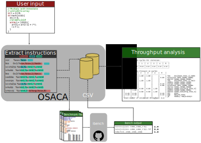

OSACA
=====

Open Source Architecture Code Analyzer
~~~~~~~~~~~~~~~~~~~~~~~~~~~~~~~~~~~~~~

This tool allows automatic instruction fetching of assembly code,
auto-generating of testcases for assembly instructions creating latency
and throughput benchmarks on a specific instruction form and throughput
analysis and throughput prediction for a innermost loop kernel.

.. image:: https://travis-ci.com/RRZE-HPC/OSACA.svg?token=393L6z2HEXNiGLtZ43s6&branch=master
    :target: https://travis-ci.com/RRZE-HPC/OSACA

.. image:: https://landscape.io/github/RRZE-HPC/OSACA/master/landscape.svg?style=flat&badge_auth_token=c95f01b247f94bc79c09d21c5c827697
   :target: https://landscape.io/github/RRZE-HPC/OSACA/master
   :alt: Code Health

Getting started
===============

Installation
~~~~~~~~~~~~
.. On most systems with python pip and setuputils installed, just run:
.. ::
   pip install --user osaca
.. for the latest release.
To build OSACA from source, clone this repository using ``git clone https://github.com/RRZE-HPC/OSACA`` and run in the root directory:
::
   python ./setup.py install

After installation, OSACA can be started with the command ``osaca`` in the CLI.

Dependencies:
~~~~~~~~~~~~~~~
Additional requirements are:

-  `Python3 <https://www.python.org/>`_
-  `pandas <http://pandas.pydata.org/>`_
-  `NumPy <http://www.numpy.org/>`_
-  `Kerncraft <https://github.com/RRZE-HPC/kerncraft>`_ for marker insertion
-   `ibench <https://github.com/hofm/ibench>`_ for throughput/latency measurements

Design
======
A schematic design of OSACA's workflow is shown below:
[image]

Usage
=====

The usage of OSACA can be listed as:
::
    osaca [-h] [-V] [--arch ARCH] [--tp-list] [-i | --iaca | -m] FILEPATH

- ``-h`` or ``--help`` prints out the help message.
- ``-V`` or ``--version`` shows the program’s version number.
- ``ARCH`` needs to be replaced with the wished architecture abbreviation. This flag is necessary for the throughput analysis (default function) and the inclusion of an ibench output (``-i``). Possible options are ``SNB``, ``IVB``, ``HSW``, ``BDW`` and ``SKL`` for the latest Intel micro architectures starting from Intel Sandy Bridge.
- While in the throughput analysis mode, one can add ``--tp-list`` for printing the additional throughput list of the kernel or ``--iaca`` for letting OSACA to know it has to search for IACA binary markers.
- ``-i`` or ``--include-ibench`` starts the integration of ibench output into the CSV data file determined by ``ARCH``.
- With the flag ``-m`` or ``--insert-marker`` OSACA calls the Kerncraft module for the interactively insertion of `IACA <https://software.intel.com/en-us/articles/intel-architecture-code-analyzer>`_ marker in suggested assembly blocks.
- ``FILEPATH`` describes the filepath to the file to work with and is always necessary

Hereinafter OSACA's scope of function will be described.

Throughput analysis
~~~~~~~~~~~~~~~~~~~
As main functionality of OSACA this process starts by default. It is always necessary to specify the core architecture by the flag ``--arch ARCH``, where ``ARCH`` can stand for ``SNB``, ``IVB``, ``HSW``, ``BDW`` or ``SKL``.

For extracting the right kernel, one has to mark it beforehand. For this there are two different approaches:

| **High level code**
The OSACA marker is ``//STARTLOOP`` and must be put in one line in front of the loop head, and the loop code must be indented consistently. This means the marker and the head must have the same indentation level while the whole loop body needs to be more indented than the code before and after. For instance, this is a valid OSACA marker:
.. code::
    int i = 0;
    //STARTLOOP
    while(i < N){
        // do something...
        i++;
    }

| **Assembly code**
Another way for marking a kernel is to insert the IACA byte markers in the assembly file in before and after the loop.
For this, the start marker has to be inserted right in front of the loop label and the end marker directly after the jump instruction.
Start and end marker can be seen in the example below:
.. code::
    movl    $111,%ebx       #IACA START MARKER
    .byte   100,103,144     #IACA START MARKER
    # LABEL
        # do something
        # ...
        # conditional jump to LABEL
    movl    $222,%ebx       #IACA END MARKER
    .byte   100,103,144     #IACA END MARKER

The optional flag ``--iaca`` defines if OSACA needs to search for the IACA byte markers or the OSACA marker in the chosen file.

With an additional, optional ``--tp-list``, OSACA adds a simple list of all kernel instruction forms together with their reciprocal throughput to the output. This is helpful in case of no further information about the port binding of the single instruction forms.

Include new measurements into the data file
~~~~~~~~~~~~~~~~~~~~~~~~~~~~~~~~~~~~~~~~~~~
Running OSACA with the flag ``-i`` or ``--include-ibench`` and a specified micro architecture ``ARCH``, it
takes the values given in an ibench output file and checks them for reasonability. If a value is not in the data file already, it will be added, otherwise OSACA prints out a warning message and keeps the old value in the data file. If a value does not pass the validation, a warning message is shown, however, OSACA will keep working with the new value.
The handling of ibench is shortly described in the example section below.

Insert IACA markers
~~~~~~~~~~~~~~~~~~~
Using the ``-m`` or ``--insert-marker`` flags for a given file, OSACA calls the implemented Kerncraft module for identifying and marking the inner-loop block in *manual mode*. More information about how this is done can be found in the `Kerncraft repository <https://github.com/RRZE-HPC/kerncraft>`_.

Example
=======

Credits
=======
Implementation: Jan Laukemann

License
=======
`AGPL-3.0 </LICENSE>`_
