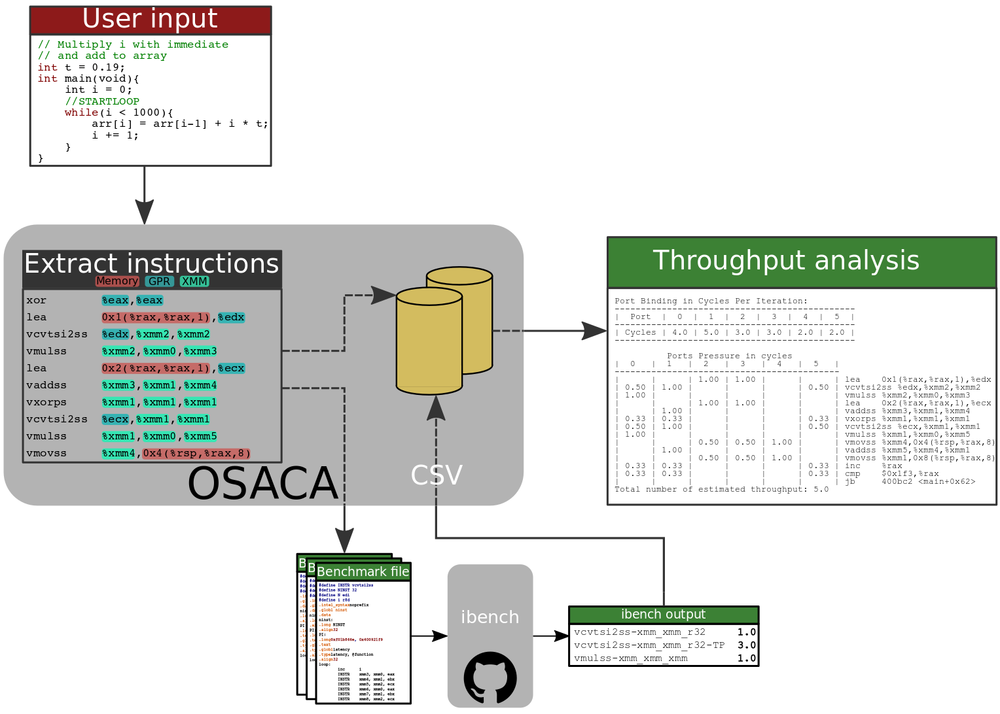

   
OSACA
=====

Open Source Architecture Code Analyzer
~~~~~~~~~~~~~~~~~~~~~~~~~~~~~~~~~~~~~~

This tool allows automatic instruction fetching of assembly code,
auto-generating of testcases for assembly instructions creating latency
and throughput benchmarks on a specific instruction form and throughput
analysis and throughput prediction for a innermost loop kernel.

.. image:: https://travis-ci.com/RRZE-HPC/OSACA.svg?token=393L6z2HEXNiGLtZ43s6&branch=master
    :target: https://travis-ci.com/RRZE-HPC/OSACA

.. image:: https://landscape.io/github/RRZE-HPC/OSACA/master/landscape.svg?style=flat&badge_auth_token=c95f01b247f94bc79c09d21c5c827697
   :target: https://landscape.io/github/RRZE-HPC/OSACA/master
   :alt: Code Health

Getting started
===============

Installation
~~~~~~~~~~~~
On most systems with python pip and setuputils installed, just run:

.. code:: bash

    pip install --user osaca

for the latest release.

To build OSACA from source, clone this repository using ``git clone https://github.com/RRZE-HPC/OSACA`` and run in the root directory:

.. code:: bash

   python ./setup.py install

After installation, OSACA can be started with the command ``osaca`` in the CLI.

Dependencies:
~~~~~~~~~~~~~~~
Additional requirements are:

-  `Python3 <https://www.python.org/>`_
-  `pandas <http://pandas.pydata.org/>`_
-  `NumPy <http://www.numpy.org/>`_
-  `Kerncraft <https://github.com/RRZE-HPC/kerncraft>`_ for marker insertion
-   `ibench <https://github.com/hofm/ibench>`_ for throughput/latency measurements

Design
======
A schematic design of OSACA's workflow is shown below:

Usage
=====

The usage of OSACA can be listed as:

.. code:: bash

    osaca [-h] [-V] [--arch ARCH] [--tp-list] [-i | --iaca | -m] FILEPATH

- ``-h`` or ``--help`` prints out the help message.
- ``-V`` or ``--version`` shows the program’s version number.
- ``ARCH`` needs to be replaced with the wished architecture abbreviation. This flag is necessary for the throughput analysis (default function) and the inclusion of an ibench output (``-i``). Possible options are ``SNB``, ``IVB``, ``HSW``, ``BDW`` and ``SKL`` for the latest Intel micro architectures starting from Intel Sandy Bridge and ``ZEN`` for AMD Zen (17h family) architecture .
- While in the throughput analysis mode, one can add ``--tp-list`` for printing the additional throughput list of the kernel or ``--iaca`` for letting OSACA to know it has to search for IACA binary markers.
- ``-i`` or ``--include-ibench`` starts the integration of ibench output into the CSV data file determined by ``ARCH``.
- With the flag ``-m`` or ``--insert-marker`` OSACA calls the Kerncraft module for the interactively insertion of `IACA <https://software.intel.com/en-us/articles/intel-architecture-code-analyzer>`_ marker in suggested assembly blocks.
- ``FILEPATH`` describes the filepath to the file to work with and is always necessary

Hereinafter OSACA's scope of function will be described.

Throughput analysis
~~~~~~~~~~~~~~~~~~~
As main functionality of OSACA this process starts by default. It is always necessary to specify the core architecture by the flag ``--arch ARCH``, where ``ARCH`` can stand for ``SNB``, ``IVB``, ``HSW``, ``BDW``, ``SKL`` or ``ZEN``.

For extracting the right kernel, one has to mark it beforehand. For this there are two different approaches:

| **High level code**

The OSACA marker is ``//STARTLOOP`` and must be put in one line in front of the loop head, and the loop code must be indented consistently. This means the marker and the head must have the same indentation level while the whole loop body needs to be more indented than the code before and after. For instance, this is a valid OSACA marker:

.. code-block:: c

    int i = 0;
    //STARTLOOP
    while(i < N){
        // do something...
        i++;
    }

| **Assembly code**

Another way for marking a kernel is to insert the IACA byte markers in the assembly file in before and after the loop.
For this, the start marker has to be inserted right in front of the loop label and the end marker directly after the jump instruction.
Start and end marker can be seen in the example below:

.. code-block:: gas

    movl    $111,%ebx       ;IACA START MARKER
    .byte   100,103,144     ;IACA START MARKER
    ; LABEL
        ; do something
        ; ...
        ; conditional jump to LABEL
    movl    $222,%ebx       ;IACA END MARKER
    .byte   100,103,144     ;IACA END MARKER

The optional flag ``--iaca`` defines if OSACA needs to search for the IACA byte markers or the OSACA marker in the chosen file.

With an additional, optional ``--tp-list``, OSACA adds a simple list of all kernel instruction forms together with their reciprocal throughput to the output. This is helpful in case of no further information about the port binding of the single instruction forms.

Include new measurements into the data file
~~~~~~~~~~~~~~~~~~~~~~~~~~~~~~~~~~~~~~~~~~~
Running OSACA with the flag ``-i`` or ``--include-ibench`` and a specified micro architecture ``ARCH``, it
takes the values given in an ibench output file and checks them for reasonability. If a value is not in the data file already, it will be added, otherwise OSACA prints out a warning message and keeps the old value in the data file. If a value does not pass the validation, a warning message is shown, however, OSACA will keep working with the new value.
The handling of ibench is shortly described in the example section below.

Insert IACA markers
~~~~~~~~~~~~~~~~~~~
Using the ``-m`` or ``--insert-marker`` flags for a given file, OSACA calls the implemented Kerncraft module for identifying and marking the inner-loop block in *manual mode*. More information about how this is done can be found in the `Kerncraft repository <https://github.com/RRZE-HPC/kerncraft>`_.

Example
=======
For clarifying the functionality of OSACA a sample kernel is analyzed for an Intel IVB core hereafter:

.. code-block:: c

    double a[N], double b[N];
    double s;
    
    //STARTLOOP
    for(int i = 0; i < N; ++i)
        a[i] = s * b[i];
        
The code shows a simple scalar multiplication of a vector ``b`` and a floating-point number ``s``. The result is
written in vector ``a``.
After including the OSACA marker ``//STARTLOOP`` and compiling the source, one can
start the analysis typing 

.. code:: bash

    osaca --arch IVB PATH/TO/FILE

in the command line. Optionally, one can create the assembly code out of the file, identify and mark the kernel of interest and run OSACA with the additional ``--iaca`` flag.

The output is:

.. code-block::

    Throughput Analysis Report
    --------------------------
    X - No information for this instruction in database
    * - Instruction micro-ops not bound to a port
    
    Port Binding in Cycles Per Iteration:
    -------------------------------------------------
    |  Port  |   0  |   1  |  2  |  3  |  4  |   5  |
    -------------------------------------------------
    | Cycles | 2.33 | 1.33 | 5.0 | 5.0 | 2.0 | 1.33 |
    -------------------------------------------------
             
             Ports Pressure in cycles          
    |  0   |  1   |  2   |  3   |  4   |  5   |
    -------------------------------------------
    |      |      | 0.50 | 0.50 | 1.00 |      | movl   $0x0,-0x24(%rbp)
    |      |      |      |      |      |      | jmp    10b <scale+0x10b>
    |      |      | 0.50 | 0.50 |      |      | mov    -0x48(%rbp),%rax
    |      |      | 0.50 | 0.50 |      |      | mov    -0x24(%rbp),%edx
    | 0.33 | 0.33 |      |      |      | 0.33 | movslq %edx,%rdx
    |      |      | 0.50 | 0.50 |      |      | vmovsd (%rax,%rdx,8),%xmm0
    | 1.00 |      | 0.50 | 0.50 |      |      | vmulsd -0x50(%rbp),%xmm0,%xmm0
    |      |      | 0.50 | 0.50 |      |      | mov    -0x38(%rbp),%rax
    |      |      | 0.50 | 0.50 |      |      | mov    -0x24(%rbp),%edx
    | 0.33 | 0.33 |      |      |      | 0.33 | movslq %edx,%rdx
    |      |      | 0.50 | 0.50 | 1.00 |      | vmovsd %xmm0,(%rax,%rdx,8)
    |      |      |      |      |      |      | X addl   $0x1,-0x24(%rbp)
    |      |      | 0.50 | 0.50 |      |      | mov    -0x24(%rbp),%eax
    | 0.33 | 0.33 | 0.50 | 0.50 |      | 0.33 | cmp    -0x54(%rbp),%eax
    |      |      |      |      |      |      | jl     e4 <scale+0xe4>
    | 0.33 | 0.33 |      |      |      | 0.33 | mov    %rcx,%rsp
    Total number of estimated throughput: 5.0

It shows the whole kernel together with the average port pressure of each instruction form and the overall port binding.
In the fifth to last line containing ``addl $0x1, -0x24(%rbp)`` one can see an ``X`` in front of the instruction form and no port occupation.
This means either there are no measured values for this instruction form or no port binding is provided in the
data file.
In the first case, OSACA automatically creates two benchmark assembly files (``add-mem_imd.S`` for latency and ``add-mem_imd-TP.S`` for throughput) in the benchmark folder, if it not already exists there.

One can now run ibench to get the throughput value for addl with the given file. Mind that the assembly
file, which is used for ibench, is implemented in Intel syntax. So for a valid run instruction ``addl`` must be
changed to ``add`` manually.

For measuring the instruction forms with ibench we highly recommend to use an exclusively allocated node,
so there is no other workload falsifying the results. For the correct function of ibench the benchmark files
from OSACA need to be placed in a subdirectory of src in root so ibench can create the a folder with the
subdirectory’s name and the shared objects. For running the tests the frequencies of all cores must set to a
constant value and this has to be given as an argument together with the directory of the shared objects to
ibench, e.g.:

.. code:: bash

    ./ibench ./AVX 2.2
    
for running ibench in the directory ``AVX`` with a core frequency of 2.2 GHz.
We get an output like:

.. code:: bash

    Using frequency 2.20GHz.
    add-mem_imd-TP: 1.023 (clock cycles) [DEBUG - result: 1.000000]
    add-mem_imd: 6.050 (clock cycles) [DEBUG - result: 1.000000]
    
The debug output as resulting value of register ``xmm0`` is additional validation information depending on
the executed instruction form meant for the user and is not considered by OSACA.
The ibench output information can be included by OSACA running the program with the flag ``--include-ibench`` or just
``-i`` and the specify micro architecture:

.. code-block:: bash

    osaca --arch IVB -i PATH/TO/IBENCH-OUTPUTFILE

For now no automatic allocation of ports for a instruction form is implemented, so for getting an output in the Ports Pressure table, one must add the port occupation by hand.
We know that the inserted instruction form must be assigned always to Port 2, 3 and 4 and additionally to either 0, 1 or 5, a valid data file therefore would look like this:

.. code:: bash

    addl-mem_imd,1.0,6.0,"(0.33,0.33,1.00,1.00,1.00,0.33)"
    
Another thorughput analysis with OSACA now returns all information for the kernel:

.. code-block::

    Throughput Analysis Report
    --------------------------
    X - No information for this instruction in database
    * - Instruction micro-ops not bound to a port
    
    Port Binding in Cycles Per Iteration:
    -------------------------------------------------
    |  Port  |   0  |   1  |  2  |  3  |  4  |   5  |
    -------------------------------------------------
    | Cycles | 2.67 | 1.67 | 6.0 | 6.0 | 3.0 | 1.67 |
    -------------------------------------------------
             
             Ports Pressure in cycles          
    |  0   |  1   |  2   |  3   |  4   |  5   |
    -------------------------------------------
    |      |      | 0.50 | 0.50 | 1.00 |      | movl   $0x0,-0x24(%rbp)
    |      |      |      |      |      |      | jmp    10b <scale+0x10b>
    |      |      | 0.50 | 0.50 |      |      | mov    -0x48(%rbp),%rax
    |      |      | 0.50 | 0.50 |      |      | mov    -0x24(%rbp),%edx
    | 0.33 | 0.33 |      |      |      | 0.33 | movslq %edx,%rdx
    |      |      | 0.50 | 0.50 |      |      | vmovsd (%rax,%rdx,8),%xmm0
    | 1.00 |      | 0.50 | 0.50 |      |      | vmulsd -0x50(%rbp),%xmm0,%xmm0
    |      |      | 0.50 | 0.50 |      |      | mov    -0x38(%rbp),%rax
    |      |      | 0.50 | 0.50 |      |      | mov    -0x24(%rbp),%edx
    | 0.33 | 0.33 |      |      |      | 0.33 | movslq %edx,%rdx
    |      |      | 0.50 | 0.50 | 1.00 |      | vmovsd %xmm0,(%rax,%rdx,8)
    | 0.33 | 0.33 | 1.00 | 1.00 | 1.00 | 0.33 | addl   $0x1,-0x24(%rbp)
    |      |      | 0.50 | 0.50 |      |      | mov    -0x24(%rbp),%eax
    | 0.33 | 0.33 | 0.50 | 0.50 |      | 0.33 | cmp    -0x54(%rbp),%eax
    |      |      |      |      |      |      | jl     e4 <scale+0xe4>
    | 0.33 | 0.33 |      |      |      | 0.33 | mov    %rcx,%rsp
    Total number of estimated throughput: 6.0

Credits
=======
Implementation: Jan Laukemann

License
=======
`AGPL-3.0 </LICENSE>`_
